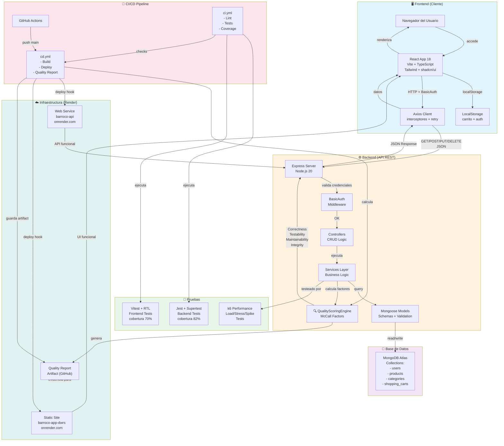
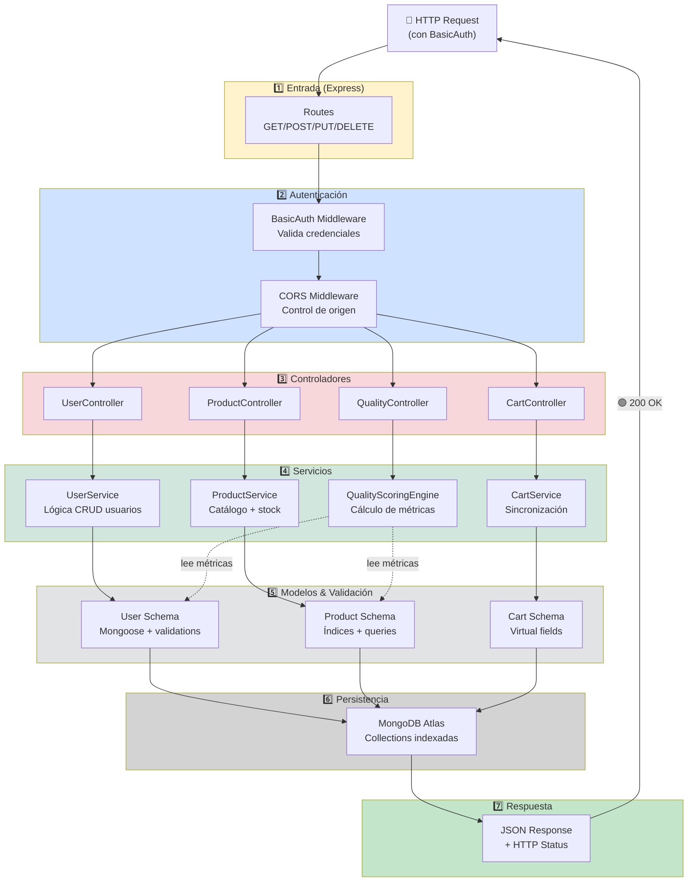
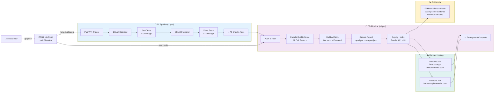
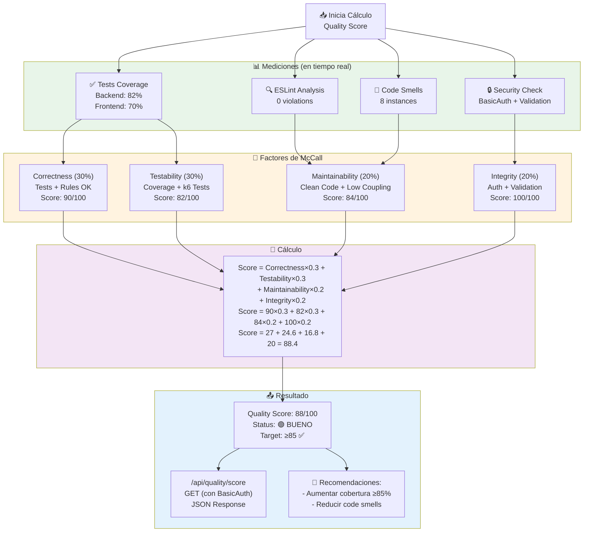
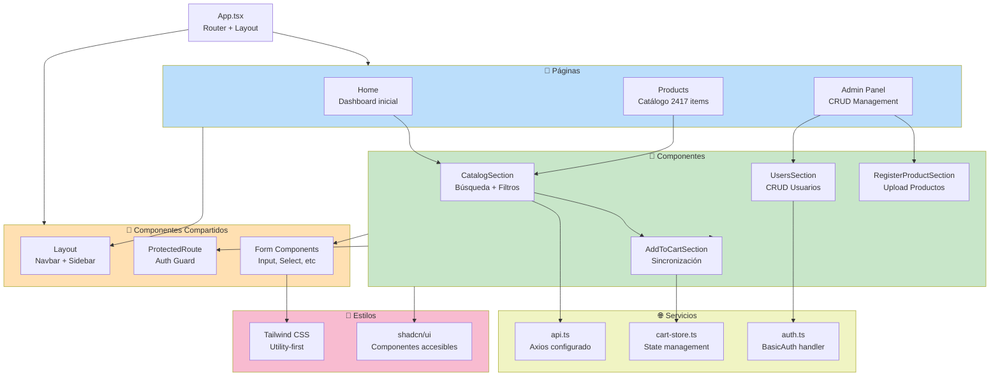
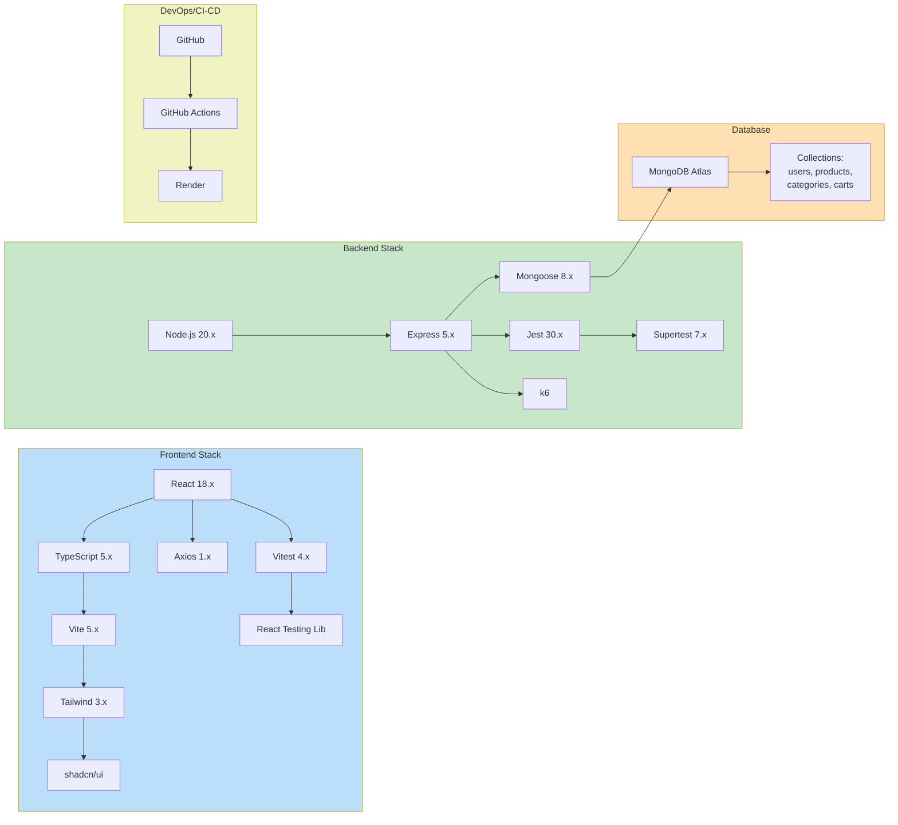

# 🏗️ Arquitectura del Proyecto - Barroco Ecommerce

## Diagrama General de Arquitectura



---

## Diagrama de Capas Detallado (Backend)



---

## Diagrama de Flujo CI/CD



---

## Diagrama del Quality Scoring Engine



---

## Diagrama de Componentes Frontend



---

## Stack Tecnológico (Mermaid)



---

## Matriz de Responsabilidades (RACI)

| Componente | Kleber | Cesar | Carlos | Dennison |
|---|---|---|---|---|
| **Autenticación/Security** | **A** | R | - | - |
| **API REST Backend** | - | **A** | R | - |
| **Quality Scoring Engine** | - | **A** | R | - |
| **Testing Backend** | - | R | **A** | - |
| **Frontend UI** | - | - | - | **A** |
| **Testing Frontend** | - | - | R | **A** |
| **CI/CD Pipeline** | - | **A** | R | - |
| **Despliegue Render** | - | **A** | R | - |

**Leyenda:**
- **A** = Accountable (responsable principal)
- **R** = Responsible (ejecuta)
- **-** = No involucrado

---

## URLs y Endpoints Clave

```mermaid
graph TB
    Client["Cliente<br/>navegador"]
    
    subgraph API_Routes["🔐 Rutas Protegidas (BasicAuth)"]
        Users["GET/POST /api/users<br/>PUT /api/users/:id<br/>DELETE /api/users/:id"]
        Products["GET/POST /api/products<br/>PUT /api/products/:id"]
        Categories["GET/POST /api/categories"]
        Carts["GET/POST /api/shopping-carts<br/>PUT /api/shopping-carts/:id"]
        Quality["GET /api/quality/score<br/>🌟 Endpoint principal"]
    end

    Client -->|HTTPS + BasicAuth| Users
    Client -->|HTTPS + BasicAuth| Products
    Client -->|HTTPS + BasicAuth| Categories
    Client -->|HTTPS + BasicAuth| Carts
    Client -->|HTTPS + BasicAuth| Quality

    Users -->|respuesta JSON| Client
    Products -->|respuesta JSON| Client
    Categories -->|respuesta JSON| Client
    Carts -->|respuesta JSON| Client
    Quality -->|{"overallScore": 88, ...}| Client

    style API_Routes fill:#fff9c4
```

---

## Resumen de Flujos Principales

### 1️⃣ Flujo: Usuario Agrega Producto al Carrito

```
Usuario → Frontend (React) → Axios + BasicAuth → Backend (Express)
  ↓                                                    ↓
Visualiza                                    CartController
  ↓                                                    ↓
LocalStorage                                CartService (lógica)
  ↓                                                    ↓
sincroniza ←─────────────────────────────── MongoDB (actualiza)
```

### 2️⃣ Flujo: Pipeline CI/CD Genera Quality Score

```
git push main → GitHub → GitHub Actions (cd.yml)
  ↓
Build Backend + Frontend
  ↓
Ejecuta Tests (cobertura)
  ↓
Consulta QualityScoringEngine → McCall Factors
  ↓
Genera quality-score-report.json
  ↓
Deploy Hooks a Render → Backend + Frontend vivo
  ↓
Guarda artifact (evidencia 90 días)
```

### 3️⃣ Flujo: Consultar Quality Score

```
curl -u frozono:trabatrix2 \
  https://barroco-api.onrender.com/api/quality/score
  ↓
BasicAuth Middleware (valida)
  ↓
QualityController
  ↓
QualityScoringEngine
  ↓
Calcula: (90×0.3) + (82×0.3) + (84×0.2) + (100×0.2) = 88
  ↓
JSON Response: {success: true, data: {overallScore: 88}, ...}
```

---

## 📚 Referencias de Arquitectura

- **Patrón MVC**: Separación de Controllers, Services, Models
- **Capas**: Rutas → Auth → Controllers → Services → Modelos → BD
- **RESTful API**: CRUD operations con HTTP methods
- **CI/CD**: GitHub Actions automatizado
- **Quality Framework**: Modelo de McCall + Ciclo PDCA
- **Cloud**: Render para hosting (Render.com)
- **Testing Pyramid**: Unit tests (base) → Integration → E2E

